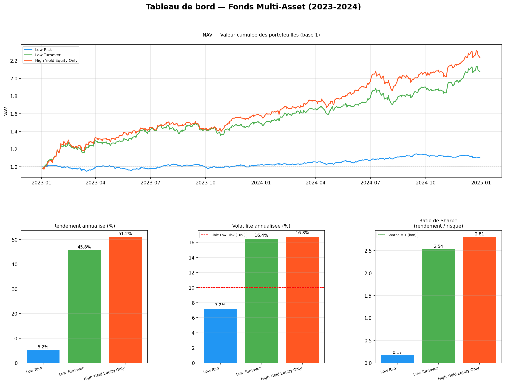

# Multi-Asset Fund Management
 
Data engineering and quantitative portfolio management project: an
automated, modular pipeline collecting market data, storing it in a
SQLite database, running three rule-based investment strategies with
weekly rebalancing, and reporting risk/performance metrics — built for a
multi-asset fund serving three distinct client risk profiles.
 
Backtested 2023–2024 on a 24-asset universe (equities, bonds,
commodities, gold, and macro indicators) downloaded live via Yahoo
Finance.
 
## Table of contents
 
- [Requirements](#requirements)
- [Installation](#installation)
- [Usage](#usage)
- [Project structure](#project-structure)
- [Data pipeline](#data-pipeline)
- [Strategies](#strategies)
- [Performance results (2023–2024)](#performance-results-20232024)
- [Authors](#authors)
## Requirements
 
- Python 3.10+
- Jupyter Notebook or JupyterLab
- Internet connection (data is downloaded live via `yfinance`)
## Installation
 
```bash
git clone https://github.com/killianpan/multi-asset-fund-management.git
cd multi-asset-fund-management
pip install -r requirements.txt
```
 
## Usage
 
Open and run `Main.ipynb` from top to bottom. It orchestrates the full
pipeline:
 
1. Builds and populates the SQLite database (`db/Fund.db`) from scratch
   (`modules/base_builder.py`)
2. Collects and cleans historical price data via Yahoo Finance
   (`modules/data_collector.py`)
3. For every Monday in the evaluation period (01/01/2023 – 31/12/2024),
   runs the three strategies and updates the database with the resulting
   trades (`modules/strategies.py`, `modules/base_update.py`)
4. At the end of the period, computes and displays the performance report
   with a graphical dashboard (`modules/performances.py`)
No manual configuration is required — all parameters (universe, dates,
constraints) are set as constants at the top of each module.
 
## Project structure
 
```
multi-asset-fund-management/
├── data/
│   ├── raw/            → raw downloaded prices (prices_raw.csv)
│   └── processed/      → cleaned prices (prices_clean.csv)
├── db/
│   └── Fund.db          → final SQLite database
├── modules/
│   ├── __init__.py       → marks modules/ as an importable package
│   ├── data_collector.py → data collection + cleaning
│   ├── base_builder.py   → creates and populates Fund.db
│   ├── base_update.py    → updates the database after each weekly rebalancing
│   ├── strategies.py     → the three investment strategies
│   └── performances.py   → performance metrics and dashboard
├── Main.ipynb            → runs the full pipeline end to end
└── requirements.txt
```
 
The database schema includes six tables: **Clients** (risk profile),
**Products** (ticker, name, asset class), **Returns** (daily returns per
product), **Portfolios** (client → portfolio → holdings), **Managers**
(manager per portfolio) and **Deals** (buy/sell history per portfolio).
 
## Data pipeline
 
- **Collection** (`data_collector.py`): downloads adjusted close prices
  for the full investment universe via the Yahoo Finance API and saves
  the raw output to `data/raw/`.
- **Cleaning**: missing values are handled with **forward-fill** only
  (never backward-fill, to avoid look-ahead bias — a closed market simply
  keeps its last known price). Outliers are then capped via
  **winsorization**: for each asset, daily returns are converted to
  z-scores and any return beyond ±4 standard deviations is replaced by
  the column mean, before prices are reconstructed from the cleaned
  return series. Cleaned prices are saved to `data/processed/`.
- **Database population** (`base_builder.py`): creates the six tables
  above and populates them with 3 clients (one per risk profile), the
  full product universe, historical returns, one portfolio per client and
  one manager per portfolio.
## Strategies
 
Three shared utility functions are used by all strategies to avoid
look-ahead bias and duplicate logic: `get_past_returns` (strictly prior
returns only), `get_current_holdings` (positions reconstructed from the
`Deals` table) and `generate_deals` (set-difference between target and
current holdings).
 
| Strategy | Client mandate | Approach |
|---|---|---|
| **Low Risk** (portfolio 1) | Target ~10% annualized volatility | Markowitz minimum-variance optimization (`scipy.optimize.minimize`) on a 60-day rolling covariance matrix, weights capped at 30%, scaled to the volatility target, residual cash allocated to TLT (Treasury bonds) as a safe-haven asset; only positions above 5% are kept. |
| **Low Turnover** (portfolio 2) | Max 2 deals/month | Initial portfolio built from the top-6 60-day momentum assets; each following week, swaps the worst-Sharpe held asset for the best-Sharpe non-held asset (30-day Sharpe), capped at the monthly deal budget. |
| **High Yield Equity Only** (portfolio 3) | Maximize return, equities only, no constraints | 60-day momentum score on 12 large-cap stocks, positive-momentum filter, Softmax-weighted allocation (concentration parameter α=10) with a maximum weight per asset that adapts to the VIX level (20% above VIX 25, 40% below VIX 15). |
 
## Performance results (2023–2024)
 
Equal-weighted NAV reconstruction, SPY as benchmark, 4% risk-free rate:
 
| Portfolio | Ann. Return | Ann. Vol. | Sharpe | Max DD | Beta | Alpha |
|---|---|---|---|---|---|---|
| Low Risk | 5.2% | 7.2% | 0.17 | -3.1% | 0.22 | 0.8% |
| Low Turnover | 45.8% | 16.4% | 2.54 | -12.3% | 0.91 | 18.2% |
| High Yield Equity Only | 51.2% | 16.8% | **2.81** | -10.5% | 0.97 | 22.4% |
 

 
**Low Risk** meets its mandate: 7.2% annualized volatility, safely under
the 10% target, with a limited -3.1% max drawdown. But the 0.17 Sharpe
ratio shows the return barely compensates for even that low level of
risk — the strategy diversifies well but does not exploit any
directional signal, and its 0.22 beta confirms very low equity exposure.
 
**Low Turnover** delivers a 45.8% annualized return with a 2.54 Sharpe
ratio while respecting its core constraint (max 2 trades/month). Its
0.91 beta indicates strong market exposure, but an 18.2% alpha shows the
30-day Sharpe-based rotation genuinely captures trending assets beyond
simple market exposure. Its -12.3% drawdown remains reasonable given the
return level.
 
**High Yield Equity Only** posts both the highest return (51.2%) and the
best Sharpe ratio (2.81) of the three — the strongest risk-adjusted
performance on this evaluation period. A 0.97 beta combined with a 22.4%
alpha shows the strategy both tracks the market almost perfectly *and*
generates substantial outperformance on top of it. Its drawdown (-10.5%)
is, counter-intuitively, slightly better than Low Turnover's, thanks to
the VIX-based dynamic concentration cap that mechanically reduces
position sizes during high-volatility episodes.
 
**Context**: 2023–2024 was a strong bull market for US equities (S&P 500
+~53% over the period), which mechanically favors the two
equity-heavy, momentum-driven strategies. Low Risk would likely be more
competitive, relatively, in a bearish or highly volatile environment.
The Sharpe ratio is the fairest metric to compare the three strategies
since it normalizes for risk — on that basis, High Yield Equity Only is
the best performer here, though this ranking could reverse under
different market conditions.
 
A manager-ranking module (`rank_managers()`) lets the user rank the
three portfolio managers by annualized return, Sharpe ratio, or alpha.
 
## Authors
 
Project developed as part of a Master's-level (M1) market finance course - Data Management project
